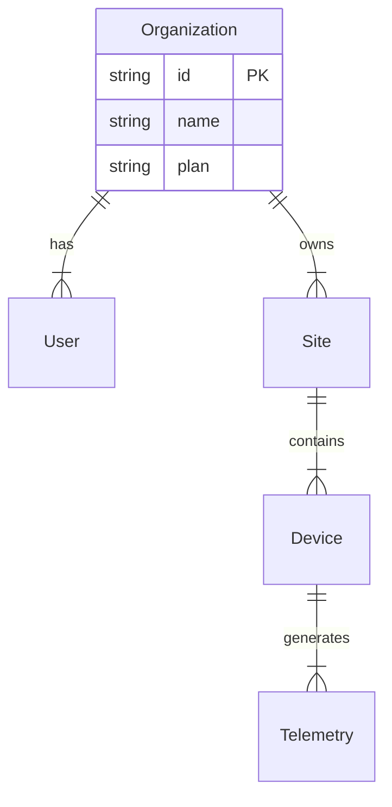

# System Architecture

## Overview
Solar Monitor is a scalable IoT platform designed to monitor and manage distributed energy resources (Postgres + Express + React).

## Current Architecture
- **Frontend**: React (Vite) + Tailwind + Recharts.
  - **Pattern**: Service Layer + Custom Hooks + Feature-based folders.
- **Backend**: Node.js (Express) + Prisma ORM.
  - **Pattern**: Layered Architecture (Routes -> Services -> ORM).
- **Database**: PostgreSQL (TimescaleDB ready).
- **IoT**: MQTT Broker (Mosquitto) for gathering telemetry.

## Future Architecture: Multi-tenancy
**Strategy**: Row-Level Tenancy (Shared Database).

### Data Model
New root entity `Organization` wraps all resources.



### Implementation Guidelines
1.  **Service Layer Injection**:
    All Services must accept `organizationId` in their constructor or method arguments.
    ```typescript
    const dashboardService = new DashboardService(user.orgId);
    ```

2.  **Middleware & Security**:
    - Middleware ensures `req.user` implies `req.user.orgId`.
    - RLS (Row Level Security) policies can be enforced at Database level (optional) or ORM level (mandatory).

3.  **Scalability**:
    - **Partitioning**: Partition `telemetry` table by time range.
    - **Sharding**: In extreme scale (>10k tenants), shard by `organizationId`.

## Code Standards (Ref. Tech Lead)
- **Frontend**: No magic numbers (use `constants`), View-only Components (use `hooks`).
- **Backend**: No inline SQL in Routes (use `services`), Stateless Routes.
